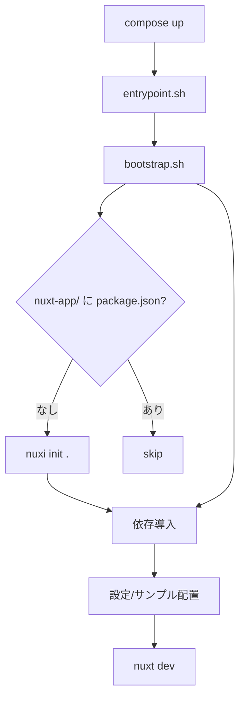

# FlyonUI × Nuxt テンプレート（Docker 初心者向けガイド）


Windows環境でNuxt.js 3とUIフレームワーク「FlyonUI」を使用して、新しいフロントエンドプロジェクトを効率的に立ち上げるための包括的なガイドです。

## 📋 目次

- [概要](#概要)
- [技術スタック](#技術スタック)
- [プロジェクト構成](#プロジェクト構成)
- [クイックスタート](#クイックスタート)
- [開発の進め方](#開発の進め方)
- [段階的セットアップ](#段階的セットアップ)
- [アーキテクチャ](#アーキテクチャ)
- [トラブルシューティング](#トラブルシューティング)
- [貢献](#貢献)
- [ライセンス](#ライセンス)

## 🎯 概要

このプロジェクトは、Docker だけあれば環境汚染ゼロで Nuxt + FlyonUI の開発を始められるテンプレートです。Node のローカルインストールは不要です。

### 主な特徴（初心者にやさしい）

- **Docker 前提**: PC に Node を入れずに動きます（Docker Desktop だけでOK）
- **自動初期化**: 初回起動で Nuxt 雛形・依存導入・サンプルを自動配置
- **高速再開**: 2回目以降は即 `docker compose up` で継続開発
- **バージョン切替**: `.env` で Nuxt 3/4 や各ライブラリの範囲を変更可能

## 🛠 技術スタック

### フロントエンド
- **[Nuxt 3](https://nuxt.com/)** - Vue.jsベースのフルスタックフレームワーク
- **[FlyonUI](https://flyonui.com/)** - Tailwind CSSベースのUIコンポーネントライブラリ
- **[Tailwind CSS](https://tailwindcss.com/)** - ユーティリティファーストのCSSフレームワーク

### 状態管理・機能
- **[Pinia](https://pinia.vuejs.org/)** - Vue.js用の直感的な状態管理ライブラリ
- **[@nuxtjs/i18n](https://i18n.nuxtjs.org/)** - 国際化対応
- **[HeadlessUI](https://headlessui.com/)** - アクセシブルなUIコンポーネント
- **[Heroicons](https://heroicons.com/)** - 美しいSVGアイコンセット

### 開発ツール
- **[ESLint](https://eslint.org/)** - コード品質管理
- **[@iconify/tailwind4](https://iconify.design/)** - アイコンシステム

## 📁 プロジェクト構成

```
/
├── docs/                           # ドキュメント
│   └── todo/
│       └── new-project-flyonui/
│           ├── README.md           # プロジェクト概要
│           ├── ARCHITECTURE.md     # アーキテクチャ設計
│           ├── AI_PROMPT_SINGLE.md # AI一括実行用プロンプト
│           └── steps/              # 段階的セットアップ手順
│               ├── 00_human_install.md
│               ├── 01_bootstrap.md
│               ├── 02_configure.md
│               ├── 03_sample_page.md
│               ├── 04_arch_examples.md
│               └── 05_review_checklist.md
├── LICENSE                         # MITライセンス
└── README.md                       # このファイル
```

## 🚀 クイックスタート（Docker 自動化）

### 前提条件

- **Docker Desktop**（Compose 含む）

### 初回起動（Nuxt 3 デフォルト）

```bash
cp env/docker.env.example .env
docker compose up --build -d  # バックグラウンド起動
docker compose logs -f web    # ログを見る（Ctrl+Cで離脱）
```

ブラウザで `http://localhost:3000` を開きます。初回は自動で Nuxt 雛形生成・依存導入・Tailwind+FlyonUI 設定・サンプル配置を行います。



### Nuxt 4 へ切替（任意）

`.env` を編集して再起動します。

```
NUXT_MAJOR=4
# 必要に応じ NUXI_INIT_ARGS="--edge" など
```

必要に応じて `.env` で各ライブラリの範囲も調整可能です（`PINIA_VERSION`, `NUXT_I18N_VERSION`, `NUXT_TAILWINDCSS_VERSION` など）。

### 構成メモ（Docker）
- `docker/` 配下にDocker定義を集約しました。
  - `docker/Dockerfile`
  - `docker/scripts/entrypoint.sh`, `docker/scripts/bootstrap.sh`
- `docker-compose.yml` はルートに配置し、`docker/Dockerfile` を参照します。

## 🧑‍💻 開発の進め方

### サーバー起動（ホットリロード）
```bash
docker compose up -d           # デタッチ起動
docker compose ps              # 状態確認
docker compose logs -f web     # ログを確認（Ctrl+Cで離脱）
```
ブラウザで `http://localhost:3000` を開きます。コード編集はローカルで行い、ホットリロードが反映されます。

### コンテナ内でコマンド実行（用途別）
```bash
# 例: 依存を再インストール
docker compose exec web npm install

# Lint
docker compose exec web npm run lint --silent || true

# ビルド
docker compose exec web npm run build

# 単体テスト（導入後の例）
docker compose exec web npm test -- --watch

# パッケージを追加/削除
docker compose exec web npm i some-pkg
docker compose exec web npm remove some-pkg
```

### よく使う操作（運用）
- **再起動**: `docker compose restart web`
- **ログを見る**: `docker compose logs -f web`
- **別シェルに入る**: `docker compose exec web bash`

### ポート設定（ホスト側の変更でOK）
- コンテナ内は 3000（アプリ）/ 24678（Vite HMR）で動作。衝突時はホスト側の公開ポートだけ変えればOKです
  ```yaml
  # docker-compose.yml 抜粋
  services:
    web:
      ports:
        - "3001:3000"   # ホスト3001 → コンテナ3000（アプリ）
        - "24679:24678" # ホスト24679 → コンテナ24678（HMR）
  ```
- 反映
  - 起動中: `docker compose restart web`
  - 停止中: `docker compose up`
- コンテナ側ポート自体を変える必要がある場合のみ、`.env` の `NUXT_PORT` を変更してください（通常不要）

### キャッシュとクリーン初期化（重要）
- いつでも「真っさら」から確認できます（ローカル Node 環境に影響しません）
- クリーン手順（すべて作り直し）
  ```bash
  docker compose down -v  # コンテナ停止/削除 + 名前付きボリューム削除（nuxt_node_modules 等）
  docker compose build --no-cache web
  docker compose up
  ```
- ビルドキャッシュをさらに削る（必要なときだけ）
  ```bash
  docker builder prune -f
  docker image prune -f
  ```

### 「コンテナを消しても大丈夫？」への答え
- はい。コードはホストの作業ディレクトリを「マウント」しているだけなので、コンテナ削除で消えません
- `node_modules` は `nuxt_node_modules` という「名前付きボリューム」に保持されます
  - コンテナだけ削除: node_modules は残る（次回起動が速い）
  - `-v` 付きで削除: ボリュームも消える（完全クリーン）

## 📚 段階的セットアップ

より確実で詳細なセットアップを希望する場合は、`docs/todo/new-project-flyonui/steps/`の段階的ガイドを使用してください。

### ステップ概要

| ステップ | ファイル | 担当 | 内容 |
|---------|---------|------|------|
| 00 | `00_human_install.md` | 人間 | Nuxt雛形作成、依存関係インストール |
| 01 | `01_bootstrap.md` | AI | ディレクトリ構造とプレースホルダー作成 |
| 02 | `02_configure.md` | AI | Nuxt設定、Tailwind+FlyonUI、ESLint設定 |
| 03 | `03_sample_page.md` | AI | サンプルページとUIコンポーネント作成 |
| 04 | `04_arch_examples.md` | AI | サービス層とプラグイン層の実装例 |
| 05 | `05_review_checklist.md` | AI/人間 | 最終確認とテスト |

### AI支援オプション

`AI_PROMPT_SINGLE.md`を使用することで、Step 01-05をAIアシスタントに一括実行させることができます。

## 🏗 アーキテクチャ

### ディレクトリ構成（生成後）

```
my-flyonui-project/
├── components/
│   └── ui/
│       ├── AppButton.vue
│       └── Toast.vue
├── layouts/
│   └── default.vue
├── pages/
│   └── index.vue
├── stores/
│   └── toast.ts
├── plugins/
│   └── api.client.ts
├── services/
│   └── api.ts
├── composables/
│   └── useApi.ts
├── middleware/
├── assets/
│   └── css/
│       └── tailwind.css
├── nuxt.config.ts
├── tailwind.config.js
└── package.json
```

### 設計原則

- **レイヤー分離**: UI、状態管理、サービス、プラグインの明確な分離
- **依存注入**: Nuxtプラグインシステムを活用したサービス提供
- **コンポーネント指向**: 再利用可能なUIコンポーネントの設計
- **国際化対応**: 多言語サポートの組み込み

### FlyonUI統合

```css
/* assets/css/tailwind.css */
@import "tailwindcss";
@plugin "flyonui";
@plugin "@iconify/tailwind4";
@import "flyonui/variants.css";
@source "./node_modules/flyonui/dist/index.js";
```

## 🔧 トラブルシューティング（Docker前提）

### よくある問題と解決方法

#### 依存関係の問題（最も多い）
- 推奨（完全クリーンで再構築）
  ```bash
  docker compose down -v
  docker compose build --no-cache web
  docker compose up
  ```
- 代替（最小限のやり直し：コンテナ内で再インストール）
  ```bash
  docker compose exec web sh -lc 'rm -rf node_modules package-lock.json && npm install'
  ```

#### ポート競合（3000が他プロセスで使用中）
- まずコンテナを停止
  ```bash
  docker compose down
  ```
- それでも空かない場合（ホスト側の別プロセスが使用）
  ```bash
  # 任意（ホストで実行）
  npx kill-port 3000
  ```

#### Tailwind / FlyonUI が効かない場合
1. `assets/css/tailwind.css` に以下があるか
   - `@plugin "flyonui";`
   - `@plugin "@iconify/tailwind4";`
   - （JSコンポーネント利用時）`@import "flyonui/variants.css";` と `@source "./node_modules/flyonui/dist/index.js";`
2. `nuxt.config.ts` に `css: ['~/assets/css/tailwind.css']` があるか
3. 反映されない場合は再起動
   ```bash
   docker compose restart web
   ```

#### Windows メモ（最低限）
- PowerShell/コマンドプロンプト/WSL いずれでもOK。Docker Desktop が動いていれば同じコマンドで動作します
- 改行は `.gitattributes` で `*.sh` を LF 固定済み（Windows でもそのまま使えます）

### 参考リンク
- [FlyonUI公式ドキュメント](https://flyonui.com/docs/)
- [Nuxt 3ドキュメント](https://nuxt.com/docs)
- [Tailwind CSSドキュメント](https://tailwindcss.com/docs)

## 🎨 カスタマイズ

### テーマのカスタマイズ
`tailwind.config.js`でカスタムテーマを設定：

```javascript
export default {
  theme: {
    extend: {
      colors: {
        primary: {
          50: '#eff6ff',
          500: '#3b82f6',
          900: '#1e3a8a',
        }
      }
    }
  }
}
```

### コンポーネントの拡張
FlyonUIコンポーネントをベースに独自コンポーネントを作成：

```vue
<!-- components/ui/MyButton.vue -->
<template>
  <button class="btn btn-primary custom-button">
    <slot />
  </button>
</template>
```

## 🤝 貢献

プロジェクトへの貢献を歓迎します！

### 貢献方法
1. このリポジトリをフォーク
2. 機能ブランチを作成 (`git checkout -b feature/amazing-feature`)
3. 変更をコミット (`git commit -m 'Add amazing feature'`)
4. ブランチにプッシュ (`git push origin feature/amazing-feature`)
5. プルリクエストを作成

### 報告・提案
- バグレポート: [Issues](../../issues)
- 機能提案: [Discussions](../../discussions)
- 質問: [Q&A](../../discussions/categories/q-a)

## 📄 ライセンス

このプロジェクトは[MIT License](LICENSE)の下で公開されています。

---

## 🔗 関連リンク

- [FlyonUI公式サイト](https://flyonui.com/)
- [Nuxt 3公式サイト](https://nuxt.com/)
- [Tailwind CSS公式サイト](https://tailwindcss.com/)
- [Vue.js公式サイト](https://vuejs.org/)

---

**作成者**: check5004  
**最終更新**: 2025年9月17日