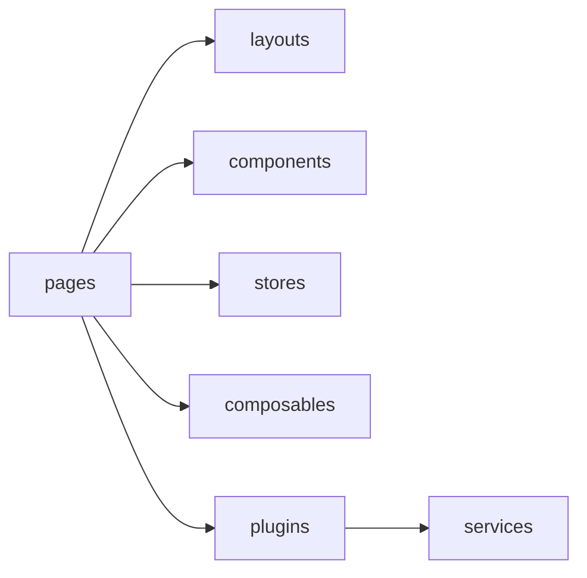
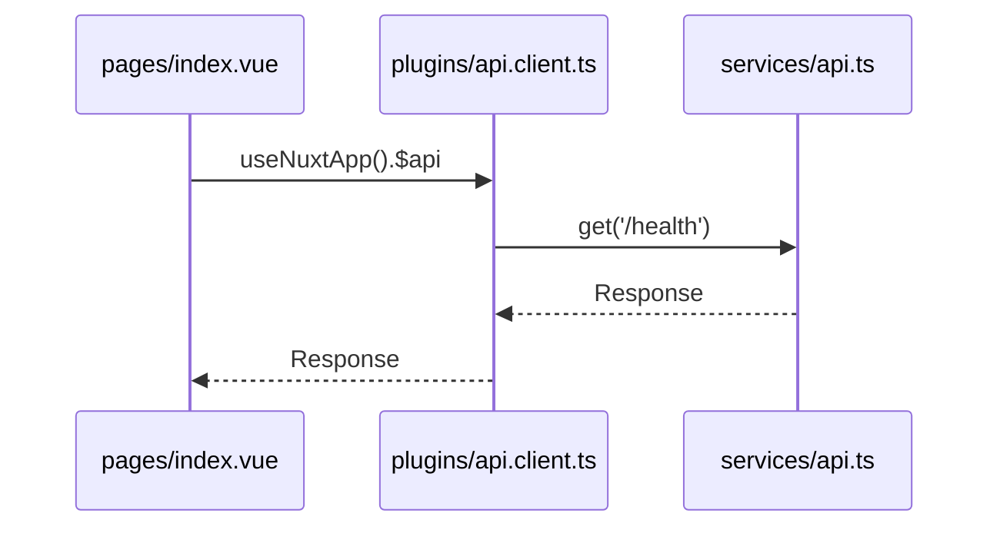
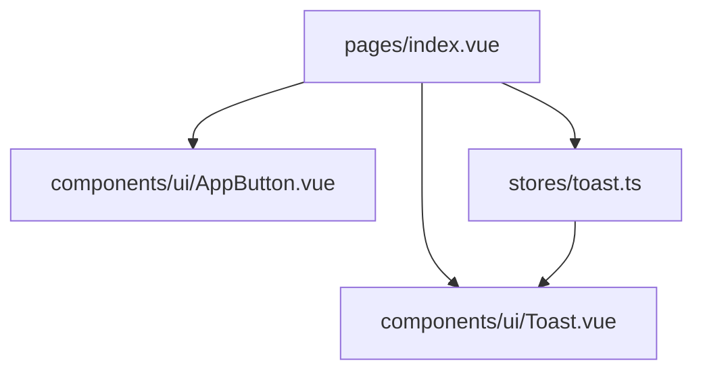

# 新規プロジェクト アーキテクチャ概要（FlyonUI 版）

Nuxt 3 を土台に、UI・状態管理・サービス・プラグインの分離で拡張性を確保します。FlyonUI は Tailwind CSS と統合され、UI 実装の生産性を高めます。

## ディレクトリ構成（論理）



## 依存注入とサービス呼び出し



## UI 分離と状態管理



補足:

- i18n は `@nuxtjs/i18n` モジュールで `locales`/`defaultLocale` を設定
- Tailwind は `@nuxtjs/tailwindcss` 経由で適用
- FlyonUI は CSS に下記のように統合します（JS コンポーネント利用時は variants と source を追加）

```css
@import "tailwindcss";
@plugin "flyonui";
@plugin "@iconify/tailwind4";
@import "flyonui/variants.css"; /* JS 利用時 */
@source "./node_modules/flyonui/dist/index.js"; /* JS 利用時 */
```

参考: [Introduction](https://flyonui.com/docs/getting-started/introduction/), [Quick Start](https://flyonui.com/docs/getting-started/quick-start/), [Vue Integration](https://flyonui.com/docs/framework-integrations/vuejs/)
