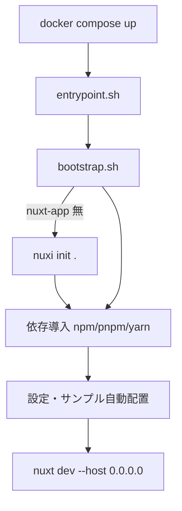
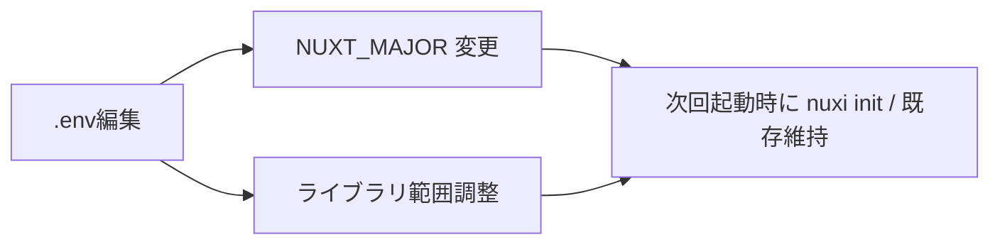

# Step 00 — Human Only → Docker 自動化に変更（人間向け／FlyonUI 版）

目的: Node のローカル環境に依存せず、Docker で開発環境を完全自動構築（Nuxt 雛形生成・依存導入・サンプル配置・起動）します。デフォルトは Nuxt 3。必要に応じて Nuxt 4 へ切替可能です。

## 前提

- OS: Windows（PowerShell）/ macOS / Linux（任意）
- 必須: Docker Desktop（Docker Compose 含む）

## クイックスタート（Nuxt 3 デフォルト）

1) 環境変数テンプレートをコピー

```bash
cp env/docker.env.example .env
```

2) 起動（初回は自動で雛形生成・依存導入・サンプル反映）

```bash
docker compose up --build
```

3) ブラウザで `http://localhost:3000` を開く

初回起動時の自動処理: Nuxt プロジェクト未作成の場合、`nuxi init` → 依存導入 → Tailwind+FlyonUI 設定/サンプル配置 → 開発サーバ起動。



## Nuxt バージョン切替（Nuxt 4 を試す）

- `.env` の以下を編集して再起動（再ビルド不要）

- `NUXT_MAJOR=4`
- `NUXI_INIT_ARGS` に `--edge` など必要に応じて指定（`nuxi` の提供オプションに依存）
- 併せて各ライブラリのバージョンを `.env` で調整可能（例）
  - `PINIA_VERSION`, `NUXT_I18N_VERSION`, `NUXT_TAILWINDCSS_VERSION` など



注意:
- 既存の `nuxt.config.ts` がある場合は自動上書きしません。Tailwind CSS の取り込み（`css: ['~/assets/css/tailwind.css']`）等は既存設定に応じて必要に応じて追記してください。

## 設定可能な環境変数（抜粋）

- `NPM_CLIENT`: `npm` | `pnpm` | `yarn`
- `NUXT_MAJOR`: 3（デフォルト）/ 4
- `NUXI_INIT_ARGS`: `--edge` 等（任意）
- `PINIA_VERSION`, `NUXT_I18N_VERSION`, `HEADLESSUI_VUE_VERSION`, `HEROICONS_VUE_VERSION`, `FLYONUI_VERSION`, `NUXT_TAILWINDCSS_VERSION`, `ICONIFY_TAILWIND4_VERSION`

## 次のステップ

- コンテナが起動すれば、`steps/01_bootstrap.md` 以降（AI）に進めます（Docker 前提）。

参考: [Introduction](https://flyonui.com/docs/getting-started/introduction/), [Quick Start](https://flyonui.com/docs/getting-started/quick-start/)
